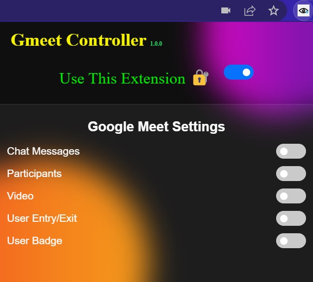

# Gmeet Controller

## Too Long to read? 😏
**Gesture control in google meet along with a handy anti-snooping, pro privacy, browser extension to save you from everyone peeping into your screen during important meetings**.🤯

People are working from home🏠 Correct?

**But what about the privacy of those who are working from public places**👨‍💻

Not really private right?.🤕

## Imagine...😈

**A meeting going on in public place**
- Working in a cafe or in a metro with your masks and earphones on.
- Attending a very important meeting with sensitive information on display.
- The people next to you keep staring at your screen and yes, we know, it gets uncomfortable. :)

**Attending a very important conference call or class**
- Also sometimes, we are busy writing something or taking notes. So it becomes quite difficult to access 
  the mouse and keyboard all the time to turn off the mic or video while doing stuffs.

Now, you can't really change the people around you. 
**But you can definitely change your meeting** ❤️

## The solution 😎
**Gmeet Controller**, A browser extension which has gesture control blurs out sensitive information zones in the gmeet and reveals them on hovering. 

See? Simple!

## How to setup and start using the extension ? ⚙️
1. Download the source code from github link and go to your browser's extension tools.
2. Turn on Developer mode.
3. Click on Load Unpacked and browse to the project folder after extracting it.
4. Select `src/` and let it load.
5. Turn on the main toggle manually by clicking (The toggle next to "Use This Extension") to turn on the extension!
6. Focus on meeting without any worries. ✌️
